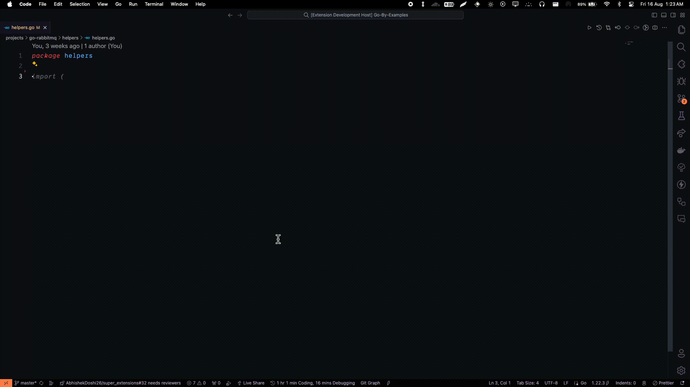

---
# Snipetizer : Create Snippets Hassle free.

Snippetizer makes it easy to create snippets for your environment easier by allowing you to create snippets directly from your workfile without switching between snippets file and manually writing JSON.

## Demo





> Note: As of release : 1.0.0 you can't add placeholders in snippets created with Snippetizer, this feature will be available in the future releases.


## Extension Usage

- Simply open the Command Palette (by default, Ctrl+Shift+P on Windows, ⌘+Shift+P on Mac) and search for "Snippetizer : Create Snippet".

- You can assign a Keybinding to have a shortcut to activate snippetizer in your `keybindings.json`

    ``` json
  {
    "key": "ctrl+shift+cmd+h",
    "command": "snippetizer.createSnippet"
  }
    ```


## Feedback
Your feedback is invaluable! If you encounter any issues or have suggestions for improvement, please [submit an issue](https://github.com/deepraj02/snippetizer/issues/new?assignees=&labels=bug&projects=&template=bug_report.md&title=fix%3A+). Contributions are also welcome; feel free to fork the repository and create a pull request.