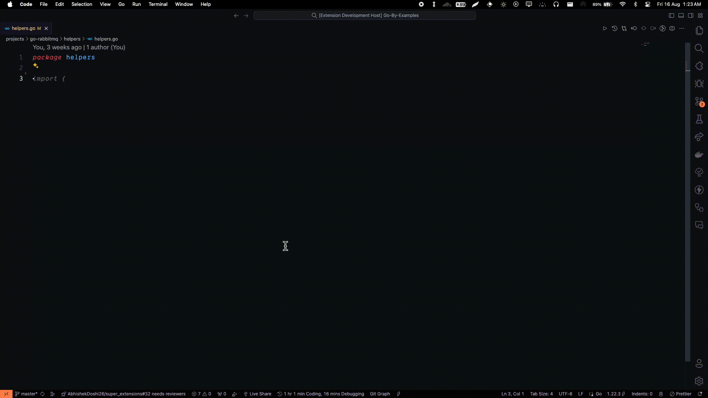
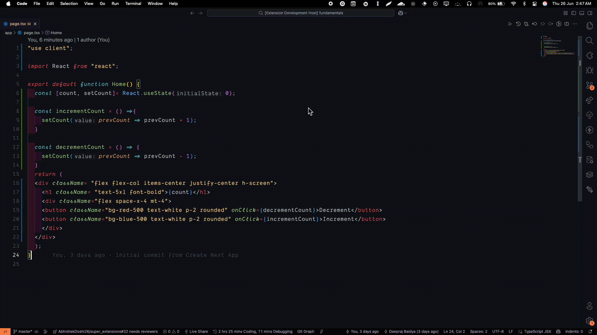

---

# Snippetizer

A Visual Studio Code extension that streamlines code snippet creation by allowing developers to generate reusable snippets directly from selected code without manual JSON editing or file navigation.

## Overview

Traditional snippet creation in VS Code involves navigating to snippet files, manually writing JSON configurations, and managing complex file structures. Snippetizer eliminates this workflow complexity by providing a direct path from code selection to snippet creation.


## Solution

Snippetizer addresses these challenges through a streamlined workflow:

1. Select code in the active editor
2. Invoke the snippet creation command
3. Provide snippet metadata through guided prompts
4. Automatic snippet file management and JSON generation

## Features

- **Direct Integration**: Create snippets without leaving the current editor context
- **Automated File Management**: Handles VS Code snippet directory structure across platforms
- **Cross-Platform Compatibility**: Supports Windows, macOS, and Linux environments
- **Input Validation**: Ensures snippet names and prefixes follow VS Code conventions
- **Flexible Organization**: Supports both existing snippet files and new file creation
- **Context Menu Integration**: Available through right-click menu when text is selected

## Demonstration

### Adding Snippets

<div style="display: flex; justify-content: space-between">
  
  
</div>

### Viewing Snippets
<div align="center">
  
</div>

<p align="center"><em>Using the "View Snippets" command to browse available snippets</em></p>


## Usage

### Command Palette Access
1. Select the target code in the editor
2. Open Command Palette (`Ctrl+Shift+P` on Windows/Linux, `⌘+Shift+P` on macOS)
3. Execute "Snippetizer: Create Snippet"
4. Complete the prompted fields for snippet configuration

### Context Menu Access
1. Select code in the active editor
2. Access the context menu via right-click
3. Select "Snippetizer: Create Snippet"
4. Provide required snippet metadata

### Keyboard Shortcut Configuration
Configure a custom keybinding in `keybindings.json`:

```json
{
  "key": "ctrl+shift+s",
  "command": "snippetizer.createSnippet",
  "when": "editorHasSelection",

  "key": "ctrl+shift+v",
  "command": "snippetizer.veiwSnippets"

}
```

## Configuration Guidelines

- **Snippet Names**: Use descriptive, meaningful identifiers
- **Prefixes**: Choose unique, memorable trigger sequences
- **Descriptions**: Optional field for snippet documentation
- **File Organization**: Organize snippets by language or functional domain
- **Naming Conventions**: Follow consistent patterns for maintainability


## Contributing

We welcome contributions to improve Snippetizer:

- **Issue Reports**: [Submit bug reports](https://github.com/deepraj02/snippetizer/issues/new?assignees=&labels=bug&projects=&template=bug_report.md&title=fix%3A+)
- **Feature Requests**: [Request enhancements](https://github.com/deepraj02/snippetizer/issues)
- **Code Contributions**: Fork the repository and submit pull requests

## License

This project is licensed under the MIT License. See the LICENSE file for details.

## Support

For questions, issues, or feature requests, please use the GitHub issue tracker or contribute to the project repository.